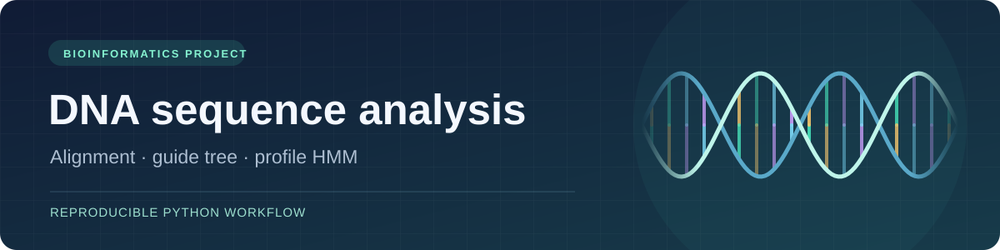
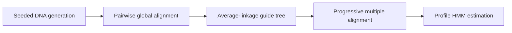

# DNA Sequence Alignment & Profile HMM

[](https://github.com/matinapap/Bioinformatics/actions/workflows/tests.yml)


**A reproducible bioinformatics project that moves from synthetic DNA sequences to a multiple alignment and a profile hidden Markov model.**

Built for a 2023–24 university bioinformatics assignment by [Matina Papadakou](https://github.com/matinapap) and [George Christopoulos](https://github.com/Georgechrp). This repository includes the original coursework artifacts and a cleaned, dependency-free demonstration that can be run in one command.

### Highlights

- **Core algorithms written from scratch:** Needleman–Wunsch global alignment, UPGMA clustering, progressive multiple alignment, and profile-HMM parameter estimation. No bioinformatics libraries are used.
- **Reproducible by design:** seeded data generation, deterministic outputs, and a one-command demo.
- **Engineered like a small tool:** installable package, `bioseq` command-line interface with input validation, unit and end-to-end tests, and CI on Python 3.9–3.13.
- **Standard output formats:** a Newick guide tree and a JSON profile.



## Quick start

From the repository root, run with **Python 3.9 or newer**. The portfolio demo uses only the Python standard library.

```bash
python3 -m bioseq demo
```

The command creates `results/` with 50 generated sequences, a 15-sequence training subset, a 35-sequence holdout subset, a multiple alignment, a Newick guide tree, and a JSON profile. The default seed is `2024`; results are reproducible. A typical run reports:

```text
Aligned 15 sequences across 44 columns
Profile contains 37 match states
Results: .../results
```

To analyze your own data, place **one unaligned A/C/G/T sequence per line** in a text file:

```bash
python3 -m bioseq analyze path/to/sequences.txt --output results/custom
```

Use `--threshold 0.8` to change the minimum non-gap occupancy for match columns. Use `python3 -m bioseq --help` for all options.

**Optional:** install the package to get a `bioseq` command:

```bash
python3 -m pip install .
bioseq demo
```

## Sample output

The first rows of `results/alignment.txt` from the default demo show the four shared motifs lining up despite mutations:

```text
--GAGAATG-GTGCGTTTGTCAGGCCT-TATACTTA-CCGT-AT
--T-GAATTG-ATCGCTTAT--GCACTC-ATAATAATTCGTACG
--TA-TGTGACGGC-CTTAT-TGG--ACAATTGTTA-TCGTAAC
-AAGAAATG-CGGTGCTTAT-TGGACGCTA-T-TGA-TCGT-AC
-CTTAAGTGACGG--GTTATCTGGAGTCAA---ATATTCGTAA-
```

`profile.json` stores per-state probabilities. For example, the first match state:

```json
"emissions":   { "M1": { "A": 0.100, "C": 0.033, "G": 0.167, "T": 0.700 } },
"transitions": { "M1": { "M2": 0.846, "D2": 0.154 } }
```

## What the pipeline does

| Stage | Method | Output |
| --- | --- | --- |
| Sequence generation | Four shared motifs with seeded substitutions, deletions, and variable flanking bases | `all_sequences.txt`, `dataset_a.txt`, `dataset_b.txt` |
| Pairwise alignment | Needleman–Wunsch dynamic programming; match `+1`, mismatch `−1`, gap `−2` | Internal pairwise distances |
| Guide tree | UPGMA average linkage using the fraction of differing aligned positions | `guide_tree.nwk` |
| Multiple alignment | Progressive consensus-guided profile alignment with gap propagation | `alignment.txt` |
| Profile HMM | Match columns selected by occupancy; observed state transitions; nucleotide emissions with a `0.5` pseudocount | `profile.json` |

The profile uses match (`M`), insertion (`I`), and deletion (`D`) states. Deletion states are silent; insertion states emit nucleotides. `profile.json` contains normalized emission and observed transition probabilities. The 35-sequence holdout is generated for future evaluation; this demo does not score or decode it.

### Scope and limitations

This is a compact educational implementation. UPGMA groups sequences by average alignment distance; the progressive alignment uses each profile’s consensus, so it may differ from a full profile-to-profile dynamic program. The profile is estimated from the training alignment. **Viterbi decoding, model validation on the holdout set, and phylogenetic inference are outside this implementation.** The guide tree is an alignment aid and should not be interpreted as an evolutionary tree.

## Repository map

```text
bioseq/                 Reproducible Python implementation and CLI
tests/                  Unit and end-to-end checks
docs/                   README banner
source2024/             Original coursework scripts (historical reference)
auxiliary2024/          Original generated datasets and alignment
bioinformatics_doc.pdf  Original assignment report
pyproject.toml          Package metadata and `bioseq` command
```

The original scripts are retained to show the project’s development. They use NumPy and write files relative to the working directory; use `bioseq` for the supported, reproducible workflow. See the [original assignment report (PDF)](bioinformatics_doc.pdf).

## Verification

```bash
python3 -m unittest discover -s tests -v
```

The tests check terminal gaps in global alignment, preservation of bases during progressive alignment, profile probability normalization, input validation, and output creation by the command-line demo. GitHub Actions runs them on every push.

## Contributors

<table>
  <tr>
    <td align="center">
      <a href="https://github.com/matinapap">
        <br>
        <b>Matina Papadakou</b>
      </a><br>
      <sub>@matinapap</sub>
    </td>
    <td align="center">
      <a href="https://github.com/Georgechrp">
        <br>
        <b>George Christopoulos</b>
      </a><br>
      <sub>@Georgechrp</sub>
    </td>
  </tr>
</table>
